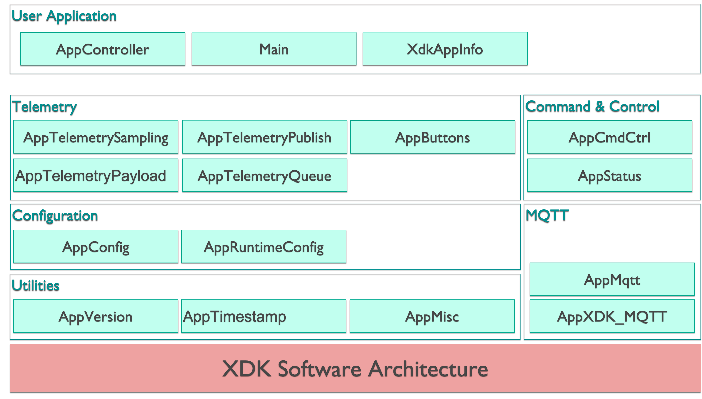

# bosch-xdk110-solace-mqtt-app

## Overview
We have developed a **_reference mqtt client app_** for the Bosch XDK110 to demonstrate how a device can be programmed to interact with a wider IoT platform.

The XDK 110 is a programmable sensor. See details here: http://xdk.bosch-connectivity.com. "I’m a programmable sensor device & a prototyping platform for any IoT use case you can imagine."

The main features of the **_reference mqtt client app_** are:
- Configuration API - allows for a device management system to remotely configure the operations of the app
- Command API - allows to send commands to the app
- Status API - sends regular and ad-hoc status information
- Sampling & Telemetry API - sends configurable sensor readings at regular intervals
- Buttons API - sends a message when pressing / releasing a button

The software architecture:

[See the source documentation here.](./docs/README.md)

## What you need before getting started

- Bosch XDK 110 + Micro SD Card + SD Card Adapter
> - Go to https://xdk.bosch-connectivity.com/buy-xdk to find a retailer.
  >   - XDK110
  >   - Micro SD card 32GB (that's the max the XDK can manage, 8GB is fine too)
  >   - SD Card Adapter to write / edit the config file onto the SD card from your computer
- XDK Workbench, version 3.6.1
> - download and install the XDK Workbench
- MQTT test client
> - For example, MQTT Box from http://workswithweb.com/mqttbox.html
- A Solace Broker - https://solace.com/try-it-now/
> - Free Solace Cloud broker: go to https://console.solace.cloud/login/new-account
> - Free download: go to https://solace.com/downloads/

## [Get started with the App on the XDK](./doc/GetStarted.md)

## [Bootstrap Configuration](./sdcard)

## [Source Code Documentation using Doxygen](./doxygen)

## API Documentation
This is included as part of the source code documentation in section **External Interfaces**.

## [Tests Scripts](./test-scripts)

## [Release Notes](./doc/ReleaseNotes.md)

------------------------------------------------------------------------------
The End.
