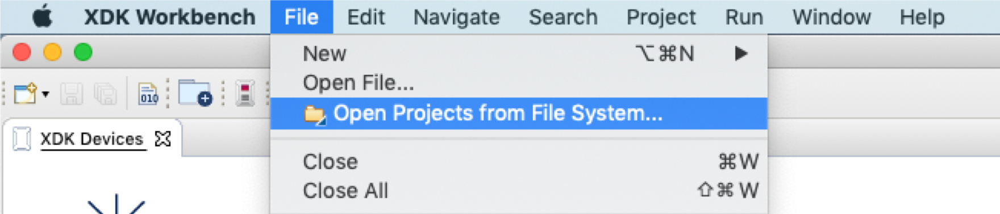
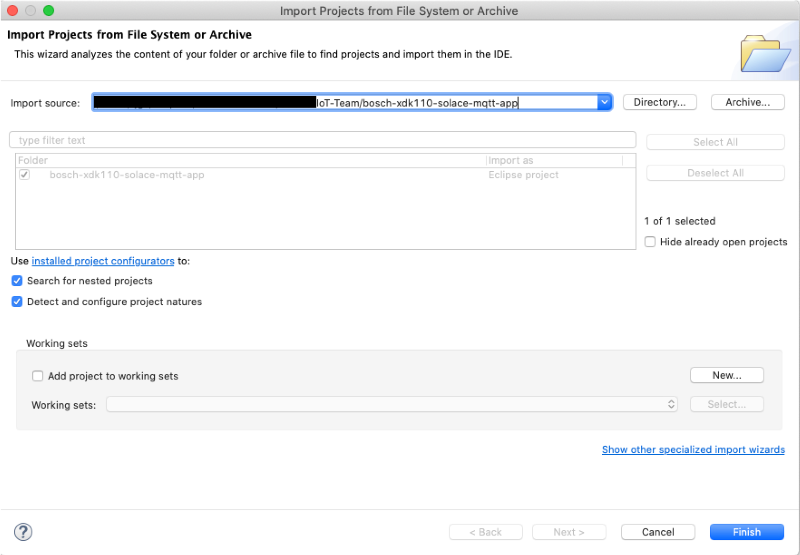
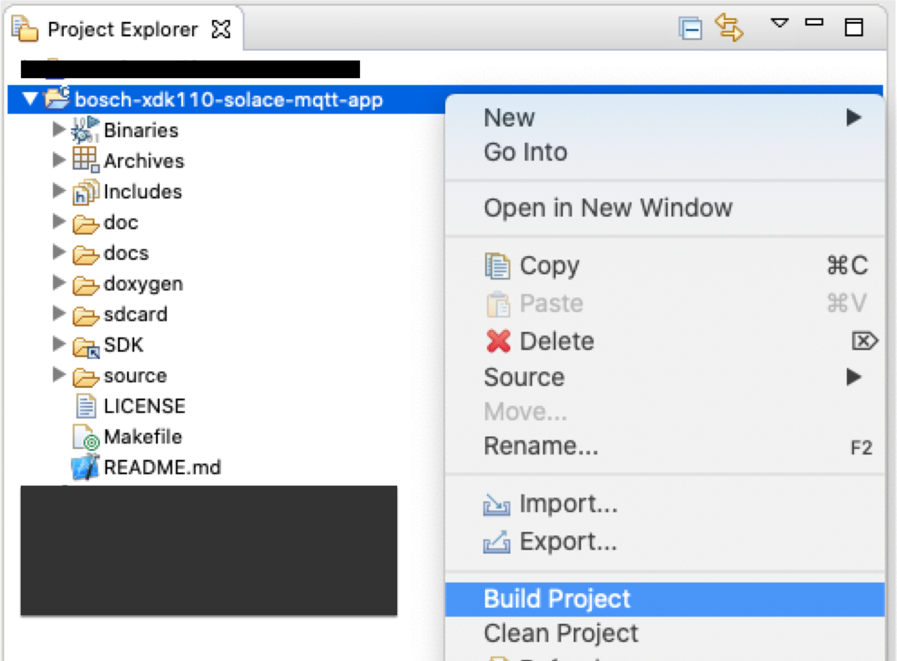
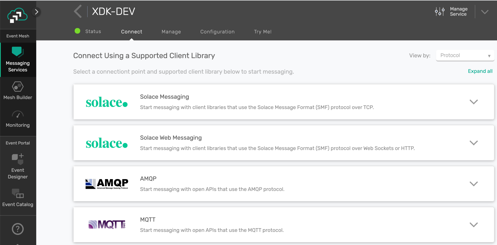
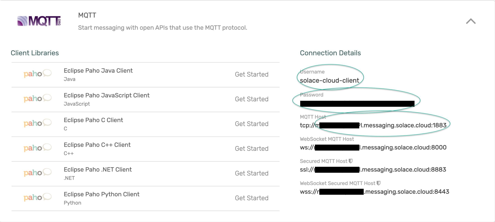
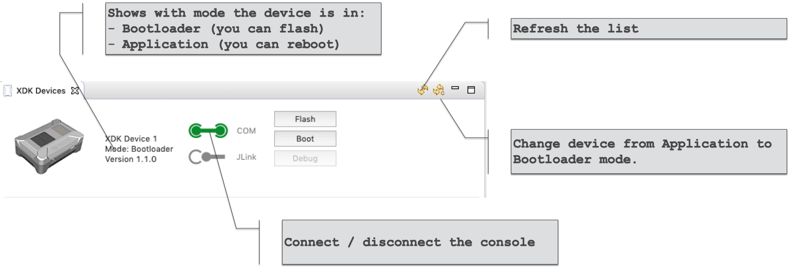

# Get started with the App on the XDK

## Clone the repository
````
git clone https://github.com/solace-iot-team/bosch-xdk110-solace-mqtt-app.git
````
### Compile the App

Start the XDK Workbench and open the project:

<p align="left"></p>

Click 'Directory ...' and select the directory with the XDK Workbench Eclipse Project

<p align="left"></p>

Click 'Finish'.

Build the project:

<p align="left"></p>

This creates the binary **_debug/SolaceMQTTApp.bin_**.

### Copy Connection Details & Credentials of the Solace Broker
In order to update the bootstrap configuration for the app, we need to get the following information for the Solace broker: **_brokerURL, brokerPort, brokerUsername, brokerPassword_**.

Go to the broker console and click on the service.
Select the **_Connect_** tab:

<p align="left"></p>

Now expand the **_MQTT_** section and copy:
- Username
- Password
- MQTT Host & Port

<p align="left"></p>

### Create and Copy the Bootstrap Config File

[Follow the instructions here.](../sdcard)

### Flash the App onto the XDK

- Connect your XDK via the USB cable to your computer.
- Switch your device on.
- Refresh the device list.
- Make sure the device is in Bootloader mode and you can see the Flash button.

<p align="left"></p>

- Click anywhere in your project in the Project Explorer (so Eclipse knows which project to flash)
- Click _**Flash**_ in the XDK Devices panel.

Sample console output from flashing:
````
INFO | Connecting to XDK device 'XDK Device 1' in port '/dev/tty.usbmodem401201'...
INFO | Connection to port '/dev/tty.usbmodem401201' established
INFO | Creating Firmware Over the Air (FOTA) Container
INFO | Binary File: <your path>/bosch-xdk110-solace-mqtt-app/debug/SolaceMQTTApp.bin
INFO | Header Version: 0100
INFO | Product Class: 0010
INFO | Product Variant: 0000
INFO | Firmware Version: 00000000
INFO | Flashing file '<your path>/bosch-xdk110-solace-mqtt-app/debug/SolaceMQTTApp.bin'...
INFO | XDK DEVICE 1: Ready
INFO | XDK DEVICE 1: C
INFO | XDK DEVICE 1: 
INFO | XDK DEVICE 1: XMODEM Download Success
INFO | XDK DEVICE 1:  CRC of application area
INFO | XDK DEVICE 1:  CRC00004A94
INFO | Application checksum '4a94' successfully verified.
INFO | Transmission successfully completed!
INFO | Booting application...
INFO | XDK DEVICE 1:  Jumping to application
````

Sample console output at start-up:
````
INFO | Connecting to XDK device 'XDK Device 1' in port '/dev/tty.usbmodem401201'...
 INFO | Connection to port '/dev/tty.usbmodem401201' established
 INFO | XDK DEVICE 1: This is a CC3100R device
 INFO | XDK DEVICE 1: CHIP 0x4000000
 INFO | XDK DEVICE 1: MAC 31.1.2.0.2
 INFO | XDK DEVICE 1: PHY 1.0.3.23
 INFO | XDK DEVICE 1: NWP 2.2.0.1
 INFO | XDK DEVICE 1: ROM 0x3333
 INFO | XDK DEVICE 1: HOST 1.0.1.11
 INFO | XDK DEVICE 1: Connected to WPA network successfully
 INFO | XDK DEVICE 1: IP address of device  <your address>
 INFO | XDK DEVICE 1:               Mask    255.255.255.0
 INFO | XDK DEVICE 1:               Gateway <your gateway>
 INFO | XDK DEVICE 1:               DNS     <your DNS>
 INFO | XDK DEVICE 1: WLANPersonalWPA2Connect : Connected to WPA network successfully.
 INFO | XDK DEVICE 1: [WARNING] - AppTimestamp_Enable: retrieving time from SNTP server, tries: 1
 INFO | XDK DEVICE 1: SntpSentCallback : Success
 INFO | XDK DEVICE 1: SntpTimeCallback : received
 INFO | XDK DEVICE 1: [INFO] - AppTimestamp_Enable: success.
 INFO | XDK DEVICE 1: [INFO] - AppXDK_MQTT_ConnectToBroker: broker mqtt://<ip address of your broker>:<your port>
 INFO | XDK DEVICE 1: [INFO] - AppXDK_MQTT_ConnectToBroker: username <your username>
 INFO | XDK DEVICE 1: [INFO] - AppXDK_MQTT_ConnectToBroker: password <your password>
 INFO | XDK DEVICE 1: [INFO] - appXDK_MQTT_EventHandler: counter: 1, event: 0:MQTT_CONNECTION_ESTABLISHED (prior: 255:UNKNOWN_EVENT)
 INFO | XDK DEVICE 1: [INFO] - AppXDK_MQTT_SubsribeToTopic : Subscribing to topic: CREATE/iot-control/region/site/sub-site/device/24d11f0358cd5d9a/command, Qos: 0
 INFO | XDK DEVICE 1: [INFO] - appXDK_MQTT_EventHandler: counter: 8, event: 8:MQTT_SUBSCRIPTION_ACKNOWLEDGED (prior: 15:MQTT_PUBLISHED_DATA)
 INFO | XDK DEVICE 1: [INFO] - AppXDK_MQTT_SubsribeToTopic : Subscribing to topic: UPDATE/iot-control/region/site/sub-site/device/24d11f0358cd5d9a/configuration, Qos: 0
 INFO | XDK DEVICE 1: [INFO] - appXDK_MQTT_EventHandler: counter: 9, event: 8:MQTT_SUBSCRIPTION_ACKNOWLEDGED (prior: 8:MQTT_SUBSCRIPTION_ACKNOWLEDGED)
 INFO | XDK DEVICE 1: [INFO] - AppXDK_MQTT_SubsribeToTopic : Subscribing to topic: CREATE/iot-control/region/site/sub-site/device/command, Qos: 0
 INFO | XDK DEVICE 1: [INFO] - appXDK_MQTT_EventHandler: counter: 10, event: 8:MQTT_SUBSCRIPTION_ACKNOWLEDGED (prior: 8:MQTT_SUBSCRIPTION_ACKNOWLEDGED)
 INFO | XDK DEVICE 1: [INFO] - AppXDK_MQTT_SubsribeToTopic : Subscribing to topic: UPDATE/iot-control/region/site/sub-site/device/configuration, Qos: 0
 INFO | XDK DEVICE 1: [INFO] - appXDK_MQTT_EventHandler: counter: 11, event: 8:MQTT_SUBSCRIPTION_ACKNOWLEDGED (prior: 8:MQTT_SUBSCRIPTION_ACKNOWLEDGED)
 INFO | XDK DEVICE 1: [INFO] - AppXDK_MQTT_SubsribeToTopic : Subscribing to topic: CREATE/iot-control/region/site/device/command, Qos: 0
 INFO | XDK DEVICE 1: [INFO] - appXDK_MQTT_EventHandler: counter: 12, event: 8:MQTT_SUBSCRIPTION_ACKNOWLEDGED (prior: 8:MQTT_SUBSCRIPTION_ACKNOWLEDGED)
 INFO | XDK DEVICE 1: [INFO] - AppXDK_MQTT_SubsribeToTopic : Subscribing to topic: UPDATE/iot-control/region/site/device/configuration, Qos: 0
 INFO | XDK DEVICE 1: [INFO] - appXDK_MQTT_EventHandler: counter: 13, event: 8:MQTT_SUBSCRIPTION_ACKNOWLEDGED (prior: 8:MQTT_SUBSCRIPTION_ACKNOWLEDGED)
 INFO | XDK DEVICE 1: [INFO] - AppXDK_MQTT_SubsribeToTopic : Subscribing to topic: CREATE/iot-control/region/device/command, Qos: 0
 INFO | XDK DEVICE 1: [INFO] - appXDK_MQTT_EventHandler: counter: 14, event: 8:MQTT_SUBSCRIPTION_ACKNOWLEDGED (prior: 8:MQTT_SUBSCRIPTION_ACKNOWLEDGED)
 INFO | XDK DEVICE 1: [INFO] - AppXDK_MQTT_SubsribeToTopic : Subscribing to topic: UPDATE/iot-control/region/device/configuration, Qos: 0
 INFO | XDK DEVICE 1: [INFO] - appXDK_MQTT_EventHandler: counter: 15, event: 8:MQTT_SUBSCRIPTION_ACKNOWLEDGED (prior: 8:MQTT_SUBSCRIPTION_ACKNOWLEDGED)
````

### Boot Status Message

The app sends out a **_boot status_** after successfully connecting to the broker.
The **_boot status_** is a 6 part message series, containing information about the version and the various configuration settings. Note: at this point, the app applies a default configuration for sampling and telemetry.

In order to capture the **_boot status_**, start a subscriber such as MQTT Box.

- configure a new broker in MQTT box - you can use the same connection details and credentials as the XDK for simplicity.
- start a subscriber to the following topic:
````
UPDATE/iot-control/+/+/+/device/+/status
````

**Reboot the XDK.**

Example first status message followed by 5 more:
````
{
  "deviceId": "<your device id>",
  "timestamp": "2020-01-15T14:58:56.432Z",
  "isManyParts": true,
  "totalNumberOfParts": 6,
  "thisPartNumber": 1,
  "statusCode": 0,
  "descrCode": 16,
  "details": "GENERAL",
  "items": [
    {
      "stats": {
        "bootTimestamp": "2020-01-15T14:58:46.238Z",
        "bootBatteryVoltage": 4370,
        "currentBatteryVoltage": 4360,
        "mqttBrokerDisconnectCounter": 0,
        "wlanDisconnectCounter": 0,
        "statusSendFailedCounter": 0,
        "telemetrySendFailedCounter": 0,
        "telemetrySendTooSlowCounter": 0,
        "telemetrySamplingTooSlowCounter": 0,
        "retcodeRaisedErrorCounter": 0
      }
    },
    {
      "versions": {
        "XDK_Version_Major": 3,
        "XDK_Version_Minor": 6,
        "XDK_Version_Patch": 0,
        "Solace_App_Version_Major": 2,
        "Solace_App_Version_Minor": 0,
        "Solace_App_Version_Patch": 1
      }
    }
  ]
}
````

The last one shows the default telemetry configuration:
- all sensors
- 1 message per second, containing
- 1 sample each

````
{
  "deviceId": "<your device id>",
  "timestamp": "2020-01-15T15:18:52.006Z",
  "isManyParts": true,
  "totalNumberOfParts": 6,
  "thisPartNumber": 6,
  "statusCode": 0,
  "descrCode": 16,
  "items": [
    {
      "targetTelemetryConfig": {
        "received": {
          "timestamp": "2020-01-15T15:18:51.213Z",
          "exchangeId": "default-exchange-id",
          "tags": {
            "mode": "APP_DEFAULT_MODE"
          },
          "delay": 1,
          "apply": "TRANSIENT",
          "activateAtBootTime": true,
          "sensorsEnable": "ALL",
          "eventFrequencyPerSec": 1,
          "samplesPerEvent": 1,
          "qos": 0,
          "payloadFormat": "V1_JSON_VERBOSE",
          "sensors": [
            "light",
            "accelerator",
            "gyroscope",
            "magnetometer",
            "humidity",
            "temperature"
          ]
        }
      }
    }
  ]
}
````

### Subscribe to the Metrics Event Stream

Create a new subscriber in MQTT Box with the following topic string:

````
CREATE/iot-event/<your-baseTopic>/<your-deviceId>/metrics
````
or, using wildcards
````
CREATE/iot-event/#
````

The message should look similar to this:

````
[
  {
    "timestamp": "2020-01-15T15:19:08.157Z",
    "deviceId": "<your device id>",
    "humidity": 44,
    "light": 118080,
    "temperature": 22.681,
    "acceleratorX": -2,
    "acceleratorY": 4,
    "acceleratorZ": 991,
    "gyroX": 793,
    "gyroY": -549,
    "gyroZ": -5673,
    "magR": 6198,
    "magX": -44,
    "magY": -38,
    "magZ": -48
  }
]
````


----
The End.
